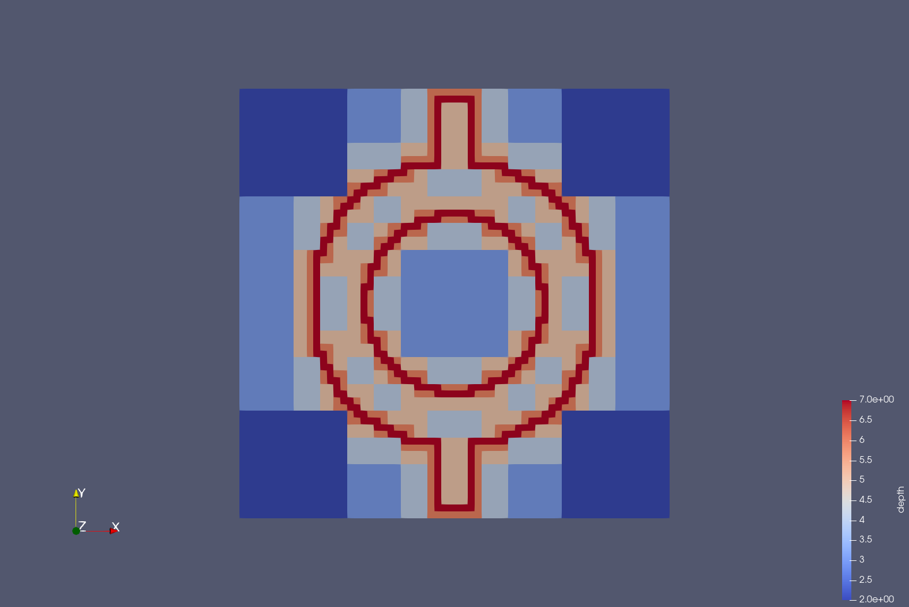

# Adaptive Geometry Modeling

A C++ geometry engine for modeling 2D implicit shapes and performing CSG operations
with adaptive quadtree subdivision. Outputs can be visualized using ParaView via `.vtk` export.

## ✨ Features

- Implicit geometry definitions (Circle, Rectangle)
- CSG operations: Union, Intersection, Difference
- Adaptive quadtree partitioning
- VTK export for visualization
- Modular, testable architecture (Catch2)

## 📁 Structure
```
adaptive-geometry-modeling/
├── library/
│   ├── inc/        # Header files (Circle, CSG, etc.)
│   └── src/        # Source files
├── drivers/        # main.cpp
├── external/       # Catch2 test framework
├── test/           # Unit tests
├── CMakeLists.txt
└── README.md
```

## 🛠 Build Instructions

```
mkdir build && cd build
cmake ..
make
./main

```

## 📊 Visualization

Open `quadtree.vtk` in ParaView to see the adaptive spatial structure:



For a quick ASCII preview:


## Example Geometry Composition

This setup models:

- A circle intersected with a square
- A vertical bar unioned with that shape
- A smaller circle subtracted from the result

Final geometry:

((Circle ∩ Square) ∪ Bar) \ Inner Circle
Or in plain ASCII:
((Circle AND Square) OR Bar) MINUS Inner Circle

## Author

Tolga Gökalp
